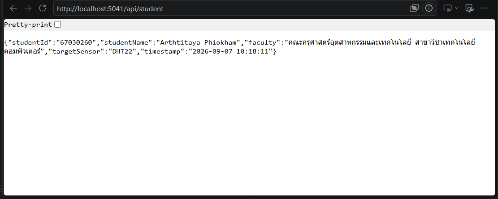

# ใบงานการทดลองที่ 8.1 (Labsheet 8.1)

#### [Checkpoint 1.1 ทดสอบความเข้าใจ]


1. ในหน้าจอ Terminal ขณะที่เซิร์ฟเวอร์กำลังรันอยู่ ให้กดปุ่ม `Ctrl + C` เพื่อหยุดโปรแกรม
2. กลับไปที่หน้าเบราว์เซอร์แล้วกดปุ่ม **Refresh (F5)** สังเกตว่าเกิดอะไรขึ้น และอธิบายสั้นๆ ว่าทำไมจึงเป็นเช่นนั้น

   - **คำตอบ** หน้าเว็บไม่สามารถโหลดได้ โดยเบราว์เซอร์จะแสดงข้อความผิดพลาด เช่น "This site can’t be reached" หรือ "Connection refused" (ERR_CONNECTION_REFUSED)

---

## ภารกิจท้าทาย (Micro-Challenge)

ให้นักศึกษาเขียน Endpoint ของตัวเองเพิ่มลงใน `Program.cs` ตามเงื่อนไขดังนี้

1. ตั้งชื่อ Path ว่า `/api/student`
2. เมื่อเปิดเข้าไปดู จะต้องคืนค่า JSON ที่มีข้อมูลดังต่อไปนี้
   - `studentId` = รหัสนักศึกษาของตนเอง (ชนิดสตริง)
   - `studentName`= ชื่อ-นามสกุลภาษาอังกฤษของตนเอง
   - `faculty`= คณะและสาขาวิชาที่กำลังศึกษา
   - `targetSensor`= ชื่อเซนเซอร์ที่ตนเองสนใจนำมาต่อกับ ESP32 ในวิชานี้ (เช่น "DHT22", "Potentiometer", "MQ-2")
   - `timestamp`= เวลาปัจจุบันของเซิร์ฟเวอร์ (`DateTime.Now.ToString(...)`)

 **หลักฐานการส่งงาน** 
 

 
```
var builder = WebApplication.CreateBuilder(args);
var app = builder.Build();

app.MapGet("/", () => "Welcome to IoT Edge Gateway by [นางสาวอาทิตยา ผิวขำ]!");

app.MapGet("/api/status", () => new {
    gateway = "ESP32-EdgeGateway",
    status = "Online",
    uptimeSeconds = Environment.TickCount64 / 1000,
    isHealthy = true
});

app.MapGet("/api/led/{state}", (string state) => {
    string action = state.ToLower() == "on" ? "TURN ON 💡" : "TURN OFF 🌑";
    Console.WriteLine($"[{DateTime.Now:HH:mm:ss}] LED Control: {state}");
    
    return Results.Ok(new {
        state = state,
        action = action,
        timestamp = DateTime.Now
    });
});

// --- Micro-Challenge Endpoint ---
app.MapGet("/api/student", () => new {
    studentId = "67030260", // ใส่รหัสนักศึกษาจริง
    studentName = "Arthtitaya Phiokham", // ใส่ชื่อ-นามสกุลภาษาอังกฤษจริง
    faculty = "คณะครุศาสตร์อุตสาหกรรมและเทคโนโลยี สาขาวิชาเทคโนโลยีคอมพิวเตอร์", // ใส่คณะและสาขาวิชาจริง
    targetSensor = "DHT22", // ใส่เซนเซอร์ที่เลือก
    timestamp = DateTime.Now.ToString("yyyy-MM-dd HH:mm:ss")
});

app.Run();
```

---

## คำถามท้ายการทดลอง (Review Questions)
1. ในสถาปัตยกรรมของ Kestrel ตัวแปร `builder` ทำหน้าที่อะไร และตัวแปร `app` ทำหน้าที่อะไร
> builder: ตั้งค่าระบบ คอนฟิกูเรชัน และลงทะเบียนเซอร์วิสก่อนรันแอป app: จัดการเส้นทาง (Routing) รับส่ง HTTP Request และสั่งรันเซิร์ฟเวอร์
2. เปรียบเทียบความสะดวกระหว่างการสร้าง Web Server บน .NET Minimal API กับการรันผ่าน LAMP Stack (Apache + PHP) ว่ามีข้อดีข้อเสียต่างกันอย่างไรในมุมมองของงาน IoT Gateway
> .NET Minimal API: ประสิทธิภาพสูง เบา ประมวลผลข้อมูลเซนเซอร์แบบ Real-time ได้ดีกว่า แต่ต้องใช้ความรู้ภาษา C# LAMP Stack: ติดตั้งและเขียนง่าย แต่กินทรัพยากร (RAM/CPU) สูงและช้า ไม่เหมาะกับอุปกรณ์ IoT สเปกต่ำ
3. นักศึกษาคิดว่าการเพิ่ม `/api/` เข้าไปใน route นั้นมีประโยชน์อย่างไรบ้าง ถ้าไม่ใส่จะเกิดปัญหาอะไรบ้าง
> ประโยชน์: แยก Endpoint สำหรับรับส่งข้อมูล (JSON) ออกจากหน้าเว็บ (HTML) ชัดเจน ตั้งค่า Proxy และความปลอดภัยง่าย ปัญหาถ้าไม่ใส่: ชื่อ URL ซ้ำกับหน้าเว็บ (Route Collision) และจัดระเบียบหรืออัปเกรดเวอร์ชันระบบในอนาคตได้ยาก