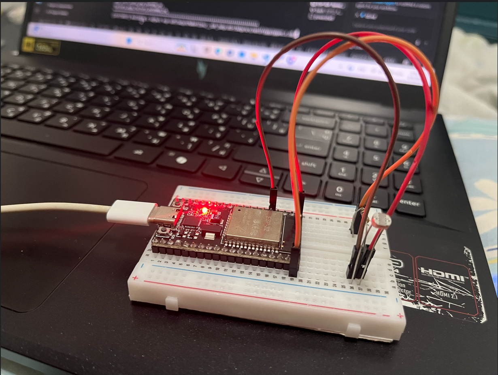
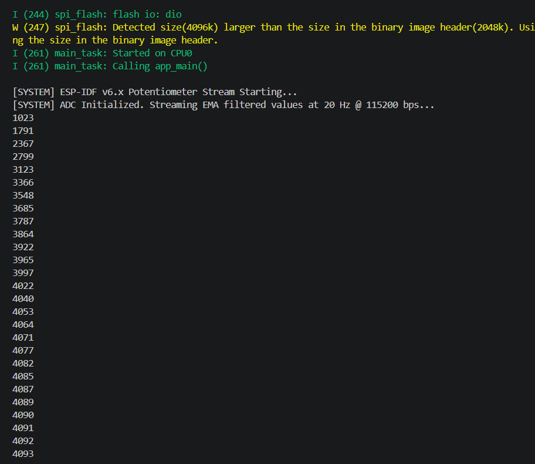

# ใบงานการทดลองที่ 8.2

#### [Checkpoint 2.1 ทดสอบความเข้าใจ]
1. ใน ESP-IDF v6.x ฟังก์ชัน `adc_oneshot_read()` คืนค่าผลลัพธ์เป็นตัวเลขแบบใด และมีช่วงค่าต่ำสุด-สูงสุดเท่าใดเมื่อตั้งค่าเป็น `ADC_BITWIDTH_12`
   - **คำตอบ:** ประเภทตัวเลข: จำนวนเต็ม (int / Raw Value) ช่วงค่า: 0 ถึง 4095 (รวม 4,096 ระดับ สำหรับความละเอียด 12-bit)
   
2. ทำไมเราจึงต้องกดปุ่ม `Ctrl + ]` เพื่อปิด **ESP-IDF Monitor** ก่อนที่เราจะรันโปรแกรมฝั่ง C# Kestrel ในใบงานถัดไป
   *(คำใบ้: หากโปรเซส idf.py monitor ยังเปิดค้างอยู่ จะเกิดอะไรขึ้นกับพอร์ต COM)*
   - **คำตอบ:** พอร์ต Serial (COM Port) สามารถถูกเปิดใช้งานได้โดย 1 โปรแกรมในเวลาเดียวกันเท่านั้น หากเปิด idf.py monitor ค้างไว้ โปรแกรมฝั่ง C# จะไม่สามารถเข้าถึงพอร์ต COM ได้ และจะเกิดข้อผิดพลาด "Access Denied" หรือ "UnauthorizedAccessException"

---

## ภารกิจท้าทาย (Micro-Challenge) (ประสบการณ์จากใบงาน LDR)
- ให้นักศึกษาทดลองเปลี่ยนตัวต้านทานปรับค่าได้เป็น **LDR (Light Dependent Resistor)** ร่วมกับตัวต้านทาน $10\text{ k}\Omega$ แบ่งแรงดัน
- ทดลองใช้ไฟฉายจากโทรศัพท์มือถือส่อง และเอามือปิดบังแสง สังเกตค่า ADC บนหน้าจอเทอร์มินัลว่าเปลี่ยนแปลงอย่างไร
- บันทึกภาพถ่ายการต่อวงจรและภาพหน้าจอ Monitor ลงในรายงานผลการทดลอง

