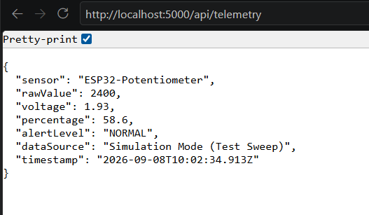

# ใบงานการทดลองที่ 8.3

#### 📋 [Checkpoint 3.1: ทดสอบกลไก Fallback Simulation]
1. ขณะที่โปรแกรม C# กำลังรันอยู่ ให้ถอดสาย USB ของ ESP32 ออกจากคอมพิวเตอร์
2. กด Refresh (F5) บนหน้าเบราว์เซอร์หลายๆ ครั้งติดต่อกัน สังเกตว่า:
   - ค่า `dataSource` เปลี่ยนเป็นอะไร?
   - ค่า `rawValue` ยังเปลี่ยนได้อยู่หรือไม่ และเปลี่ยนในลักษณะใด?
   - **คำตอบ:** ค่า dataSource เปลี่ยนเป็น: "Simulation Mode (Test Sweep)" ค่า rawValue: ยังคงเปลี่ยนแปลงได้อยู่ โดยค่าจะค่อยๆ เพิ่มขึ้นและลดลงอย่างต่อเนื่อง (จำลองสัญญาณ Sweep/Sine Wave) ในช่วง 0 ถึง 4095 ทุกครั้งที่กด Refresh (F5)

---

## 🎯 ภารกิจท้าทาย (Micro-Challenge)
- ให้นักศึกษาเพิ่มฟิลด์ `alertLevel` เข้าไปในผลลัพธ์ JSON ของ `/api/telemetry`:
  - ถ้า `percentage` มากกว่า 85.0% ให้ส่งค่า `"DANGER (HIGH)"`
  - ถ้า `percentage` ระหว่าง 70.0% - 85.0% ให้ส่งค่า `"WARNING"`
  - ถ้า `percentage` ต่ำกว่า 70.0% ให้ส่งค่า `"NORMAL"`
- บันทึกภาพหน้าจอเบราว์เซอร์ขณะหมุนไปที่ระดับต่างๆ เพื่อแสดงว่าฟิลด์ `alertLevel` ทำงานถูกต้อง

