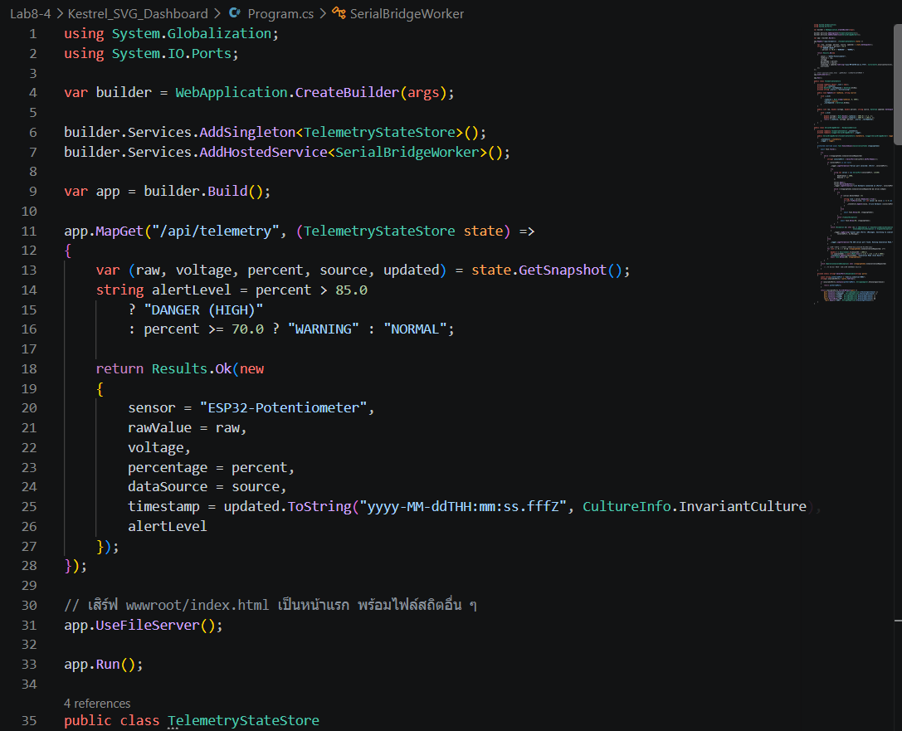
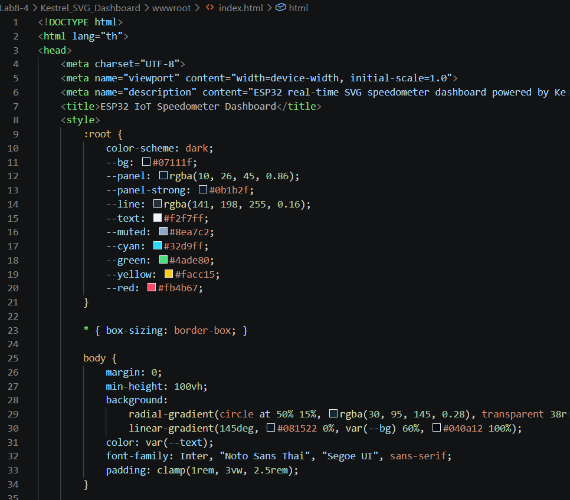

# ใบงานการทดลองที่ 8.4 (Labsheet 8.4)

## 📋 ส่งงานและประเมินผล (Submission Check)
1. บันทึกวิดีโอคลิปสั้น (15-30 วินาที) โดยในคลิปต้องเห็น:
   - นิ้วมือนักศึกษากำลังหมุนตัวต้านทานปรับค่าได้บนบอร์ด ESP32
   - หน้าจอคอมพิวเตอร์ที่เข็มไมล์ Speedometer / VU Meter กวาดตามมืออย่างชัดเจน

   # คลิปการทดลองที่ 8-4
   https://drive.google.com/file/d/1pUy-GqKIsWA4VcCr96X1jl2JIzY83MYV/view?usp=sharing
2. แนบภาพหน้าจอซอร์สโค้ดและรายงานการทดลอง

