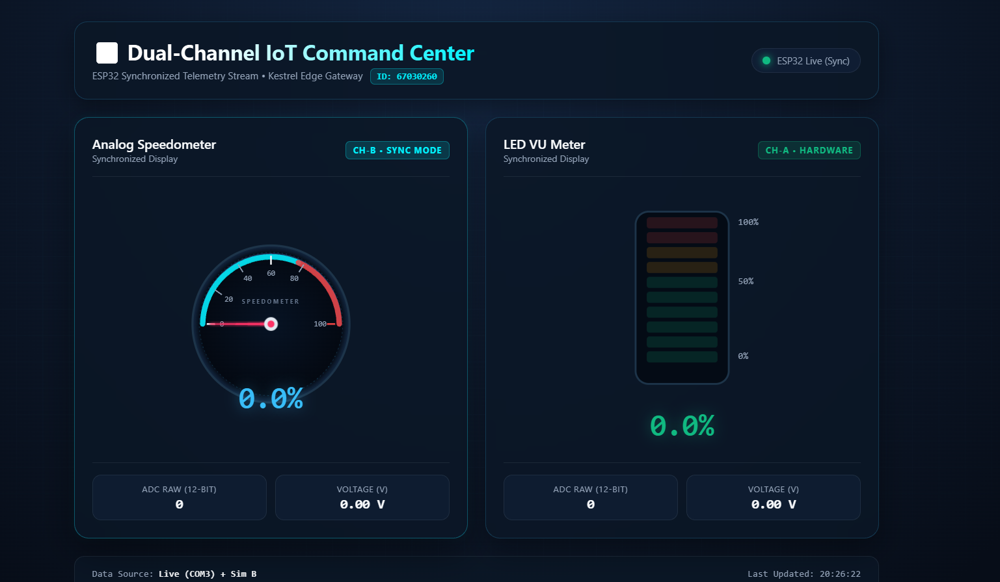
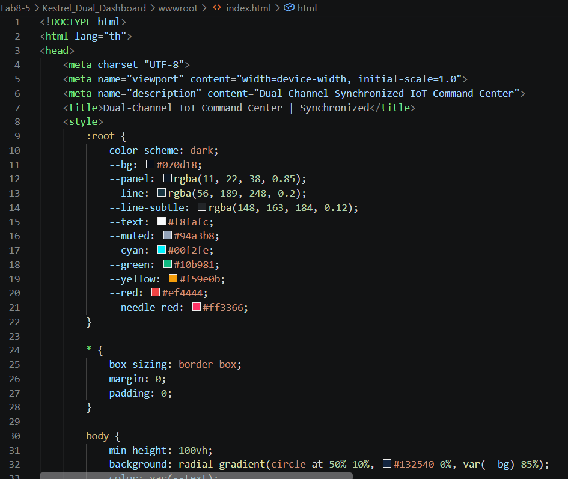
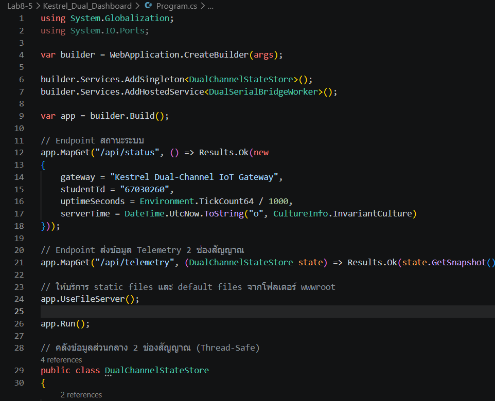
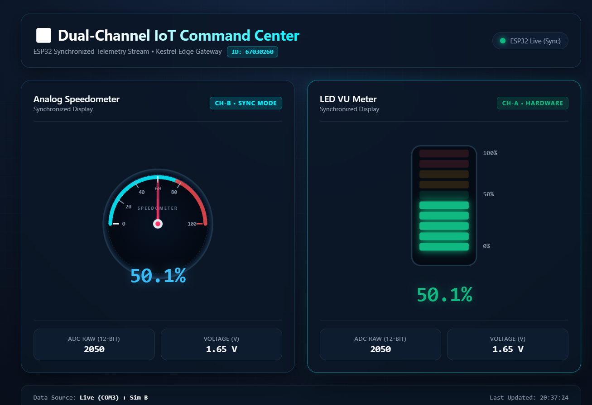

# ใบงานปฏิบัติการที่ 08-5
### ศูนย์ควบคุมเซนเซอร์คู่ IoT แบบเรียลไทม์ (Dual-Channel IoT Command Center)

##  กติกากำหนดหน้าปัดเฉพาะบุคคล (Student-ID Gauge Assignment)

รหัสนักศึกษา: **67030260** (เลข 3 ตัวท้าย $N = 260$)

1. **เกจ์ซ้าย (Channel A - Live Hardware Potentiometer)**:
   $$\text{Left} = (260 \pmod 4) + 1 = 0 + 1 = \mathbf{1}$$
   👉 **ชนิดเกจ์ที่ได้: หมายเลข 1 — Analog Speedometer (หน้าปัดเข็มไมล์กวาดมุมองศา)**

2. **เกจ์ขวา (Channel B - Simulated Sensor)**:
   $$\text{Right}_{\text{initial}} = (\lfloor 260 / 4 \rfloor \pmod 4) + 1 = (65 \pmod 4) + 1 = 1 + 1 = 2$$
   👉 **ชนิดเกจ์ที่ได้: หมายเลข 2 — Audio VU Meter (แถบไฟ VU Meter แนวตั้ง)**
   
   ---

### ตัวอย่างหน้าจอ

# คลิปการทดลองที่ 8-5
 https://drive.google.com/file/d/1PrRp9UTx8pHsnioquA9mhey7aLWi-cTg/view?usp=sharing

นักศึกษาต้องเปลี่ยนหน้าจอให้เป็นเครื่องมือตรงตามชนิดที่คำนวณได้จากเลขรหัสนักศึกษา
โดยใช้ code ที่เรียนมาแล้วในใบงานก่อนหน้า

## สรุปผลการทดลอง

* ระบุเลขรหัสนักศึกษาและแสดงวิธีคำนวณหาเกจ์ซ้าย-ขวา
1. **เกจ์ซ้าย (Channel A - Live Hardware Potentiometer)**:
   $$\text{Left} = (260 \pmod 4) + 1 = 0 + 1 = \mathbf{1}$$
   👉 **ชนิดเกจ์ที่ได้: หมายเลข 1 — Analog Speedometer (หน้าปัดเข็มไมล์กวาดมุมองศา)**

2. **เกจ์ขวา (Channel B - Simulated Sensor)**:
   $$\text{Right}_{\text{initial}} = (\lfloor 260 / 4 \rfloor \pmod 4) + 1 = (65 \pmod 4) + 1 = 1 + 1 = 2$$
   👉 **ชนิดเกจ์ที่ได้: หมายเลข 2 — LED VU Meter (แถบไฟ VU Meter แนวนอน)**

* ภาพหน้าจอแดชบอร์ดที่ทำงานสมบูรณ์

* อธิบายหลักการทำงานของฟังก์ชัน JavaScript ในการเชื่อมต่อข้อมูล
> JavaScript ชุดนี้ทำงานโดยดึงข้อมูลผ่าน API มาอัปเดตหน้าปัดทั้งสองแบบเรียลไทม์พร้อมกันผ่าน 4 ส่วนหลัก:

- pollTelemetry(): ดึงข้อมูลจาก /api/telemetry แบบ Asynchronous นำค่าเปอร์เซ็นต์, ADC และแรงดันไฟฟ้าไปอัปเดตทั้งสองหน้าปัดพร้อมกัน พร้อมสลับสถานะการเชื่อมต่อ (Live/Simulation/Offline)

- updateSpeedometer(pct): แปลงค่าเปอร์เซ็นต์ (0–100%) ให้เป็นมุมหมุนองศา (-90° ถึง +90°) เพื่อสั่งหมุนเข็มไมล์ SVG ด้วย CSS transform: rotate()

- updateVuMeter(percentage): คำนวณจำนวนหลอดไฟ LED ที่ต้องเปิด (สเกล 10 หลอด) แล้วปรับความสว่าง (opacity) พร้อมใส่แสงเรือง (drop-shadow)

- setInterval(pollTelemetry, 50): วนลูปดึงข้อมูลซ้ำทุกๆ 50 มิลลิวินาที (20 ครั้ง/วินาที) เพื่อให้การแสดงผลดีดตามค่าจริงแบบเรียลไทม์

---

## ส่งงานและประเมินผล (Submission & Grading Rubric)

### สิ่งที่ต้องส่ง
1. **คลิปวิดีโอสาธิตการทำงาน (15 - 30 วินาที)**
   * ถ่ายให้เห็น **รหัสนักศึกษา** และผลการคำนวณคู่เกจ์
   * นิ้วมือหมุน Potentiometer บนบอร์ด ESP32 จริง แล้วเกจ์ฝั่งซ้ายกวาดตามมืออย่างชัดเจน
   * เกจ์ฝั่งขวาขยับตามข้อมูลช่อง B (Simulation หรือ เซนเซอร์ตัวที่ 2)
2. **รายงาน (markdown/pull request) สรุปผลการทดลอง**
   * ระบุเลขรหัสนักศึกษาและแสดงวิธีคำนวณหาเกจ์ซ้าย-ขวา
   * ภาพหน้าจอแดชบอร์ดที่ทำงานสมบูรณ์
   * อธิบายหลักการทำงานของฟังก์ชัน JavaScript ในการเชื่อมต่อข้อมูล

### เกณฑ์การให้คะแนน (Rubric = 100 คะแนน)
* **ความถูกต้องตามโจทย์เฉพาะบุคคล (30 คะแนน)** เกจ์ซ้ายและขวาตรงตามรหัสนักศึกษาที่คำนวณได้
* **การเชื่อมต่อและตอบสนองแบบเรียลไทม์ (30 คะแนน)** เกจ์ซ้ายตอบสนองต่อการหมุน Potentiometer ทันทีโดยไม่มีอาการกระตุกหรือดีเลย์
* **การจัดการข้อมูล 2 ช่องสัญญาณ (20 คะแนน)** ส่งและรับ JSON แบบ Dual-Channel (`channelA`, `channelB`) ถูกต้องสมบูรณ์
* **ความสวยงามและ Responsive Design (20 คะแนน)** จัดวางองค์ประกอบเป็นสัดส่วน มีแสงเรืองนีออน (Glow Effect) และปรับขนาดตามหน้าจอได้อย่างสวยงาม