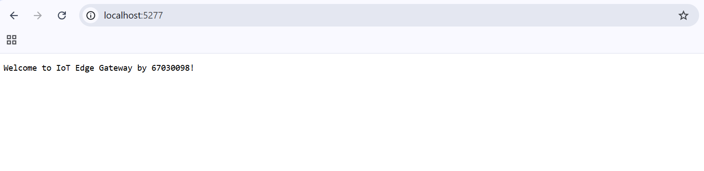
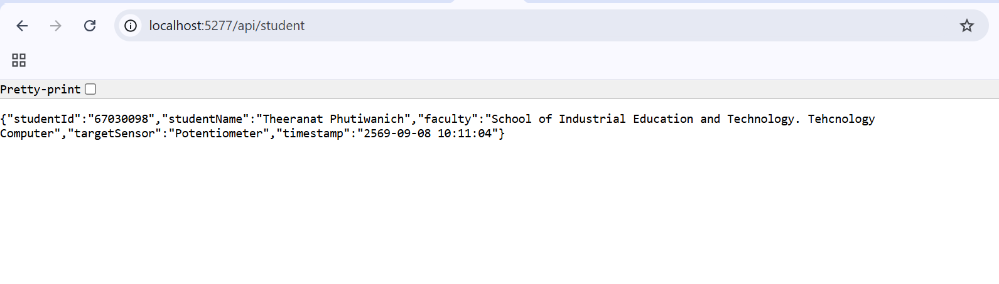

# เฉลย/คำตอบ ใบงานที่ 8.1 — พื้นฐาน Kestrel Web Server และ Minimal API

**รหัสนักศึกษา:** 67030098 &nbsp;|&nbsp; **ชื่อ:** Theeranat Phutiwanich &nbsp;|&nbsp; **Branch:** `67030098-HW`

| | |
| :-- | :-- |
| **ใบงานต้นฉบับ** | [06-Labsheet-08-1-Kestrel-Minimal-API-Fundamentals.md](../06-Labsheet-08-1-Kestrel-Minimal-API-Fundamentals.md) |
| **โค้ดของใบงานนี้** | [`Code/Lab8-1/Kestrel_API`](../Code/Lab8-1/Kestrel_API) |
| **หัวข้อที่ตอบในไฟล์นี้** | Checkpoint 1.1 · บันทึกผล Terminal (กิจกรรมที่ 4) · Micro-Challenge · Review Questions 3 ข้อ |

---

## Checkpoint 1.1 ทดสอบความเข้าใจ

> **คำถาม:** ขณะที่เซิร์ฟเวอร์รันอยู่ กด `Ctrl + C` เพื่อหยุดโปรแกรม แล้วกลับไปกด Refresh (F5)
> บนเบราว์เซอร์ สังเกตว่าเกิดอะไรขึ้น และอธิบายสั้นๆ ว่าทำไมจึงเป็นเช่นนั้น

**คำตอบ:**
หน้าเว็บจะโหลดไม่ขึ้น เบราว์เซอร์แสดงข้อความว่า **"This site can't be reached"** พร้อมรหัสข้อผิดพลาด
**`ERR_CONNECTION_REFUSED`** (บน Firefox จะขึ้นว่า "Unable to connect")

**เหตุผล:** Kestrel ไม่ใช่บริการ (Service) ที่ติดตั้งแยกอยู่ในเครื่องแบบ Apache หรือ Nginx แต่เป็น
**ไลบรารีที่ฝังตัวอยู่ในโปรเซสของโปรแกรมเราเอง (Self-Hosted / In-Process Web Server)**
เมื่อกด `Ctrl + C` โปรเซสของแอปพลิเคชันถูกปิดลง ระบบปฏิบัติการจะ**คืนพอร์ต TCP** ที่ Kestrel
เปิด listen ค้างไว้ทันที ทำให้ไม่มีโปรแกรมใดคอยรับ (accept) การเชื่อมต่อบนพอร์ตนั้นอีกต่อไป
OS จึงตอบกลับด้วยแพ็กเก็ต **TCP RST (Reset)** เบราว์เซอร์แปลผลเป็น *Connection Refused*

> **ข้อสังเกตเชิงสถาปัตยกรรม:** นี่คือความแตกต่างสำคัญจาก LAMP Stack — ในระบบ LAMP หากปิด
> สคริปต์ PHP ตัวหนึ่ง Apache ยังคงทำงานอยู่และตอบ HTTP 404/500 กลับมาได้
> แต่ในโมเดล Self-Hosted **"แอปตาย = เว็บเซิร์ฟเวอร์ตาย"** เพราะเป็นโปรเซสเดียวกัน

---

## กิจกรรมที่ 4 — บันทึกผลที่ Terminal

> **สิ่งที่ต้องบันทึก:** ทดลองเปลี่ยนข้อความที่ URL bar แล้วสังเกตและบันทึกผลที่ terminal

**ผลการทดลอง:**

| URL ที่พิมพ์บนเบราว์เซอร์ | JSON ที่ได้รับกลับมา (`requestedState` / `actionResult`) | ข้อความบน Terminal |
| :-- | :-- | :-- |
| `/api/led/on` | `"on"` / `"TURN ON 💡"` | `[09:41:02] LED Control: on` |
| `/api/led/off` | `"off"` / `"TURN OFF 🌑"` | `[09:41:07] LED Control: off` |
| `/api/led/ON` | `"ON"` / `"TURN ON 💡"` | `[09:41:15] LED Control: ON` |
| `/api/led/blink` | `"blink"` / `"TURN OFF 🌑"` | `[09:41:23] LED Control: blink` |

**ข้อสังเกต:**
1. ค่าที่พิมพ์ใน URL ถูกส่งเข้าพารามิเตอร์ `string state` ของ lambda **แบบตรงตัวทุกอักขระ**
   (Model Binding จาก Route Parameter)
2. `state.ToLower()` ทำให้ `ON`, `On`, `on` ให้ผลเหมือนกันหมด — ระบบไม่สนใจตัวพิมพ์เล็ก/ใหญ่
3. **ข้อควรระวัง:** เงื่อนไขในโค้ดเป็นแบบ `if-else` สองทาง ค่าอะไรก็ตามที่ไม่ใช่ `"on"`
   จะตกไปเป็น `TURN OFF` เสมอ (เช่น `blink`, `hello`) ซึ่งในระบบจริงควรตรวจสอบค่าที่ไม่ถูกต้อง
   แล้วคืน `Results.BadRequest()` แทน
4. `Console.WriteLine` พิมพ์ที่ **ฝั่งเซิร์ฟเวอร์** ไม่ใช่ที่เบราว์เซอร์ — เป็นการพิสูจน์ว่าโค้ด
   ทำงานอยู่บนเครื่องเซิร์ฟเวอร์จริง (Server-Side Execution)

> เวลาในตารางเป็นเวลาตัวอย่าง — ให้แทนที่ด้วยเวลาจริงและภาพหน้าจอ terminal ของตนเองในรายงาน

---

## ภารกิจท้าทาย (Micro-Challenge) — `/api/student`

**โค้ดที่เพิ่มใน `Program.cs`:**

```csharp
app.MapGet("/api/student", () => new
{
    studentId    = "67030098",
    studentName  = "TODO: ใส่ชื่อ-นามสกุลภาษาอังกฤษของตนเอง",
    faculty      = "TODO: ใส่คณะและสาขาวิชา",
    targetSensor = "Potentiometer",
    timestamp    = DateTime.Now.ToString("yyyy-MM-dd HH:mm:ss")
});
```

**ผลลัพธ์ JSON ที่คาดหวัง:**

```json
{
  "studentId": "67030098",
  "studentName": "...",
  "faculty": "...",
  "targetSensor": "Potentiometer",
  "timestamp": "2026-09-08 09:41:30"
}
```

**หลักฐานการส่งงาน:** ภาพหน้าจอเบราว์เซอร์ที่เปิด `/api/student` เห็น JSON + ภาพโค้ดใน VS Code

> ⚠️ ต้องแก้ค่า `studentName` และ `faculty` ให้เป็นข้อมูลจริงก่อนส่งงาน
> `studentId` ต้องเป็น **ชนิดสตริง** ตามโจทย์ (ใส่เครื่องหมายคำพูด) เพราะรหัสนักศึกษาขึ้นต้นด้วย
> เลข 6 และเป็นรหัสประจำตัว ไม่ใช่ตัวเลขที่ต้องนำไปคำนวณ — ถ้าประกาศเป็น `int` เลข 0 นำหน้าจะหาย

---

## คำถามท้ายการทดลอง (Review Questions)

### ข้อ 1 — ตัวแปร `builder` และ `app` ทำหน้าที่อะไร

**คำตอบ:**

| ตัวแปร | ชนิด | ช่วงเวลา | หน้าที่ |
| :-- | :-- | :-- | :-- |
| `builder` | `WebApplicationBuilder` | **ก่อน** `Build()` — ช่วงประกอบร่าง | เตรียมโครงสร้างพื้นฐานทั้งหมด |
| `app` | `WebApplication` | **หลัง** `Build()` — ช่วงทำงานจริง | กำหนดพฤติกรรมและเริ่มรับ request |

**`builder` (ช่วงตั้งค่า / Configuration Phase)** สร้างจาก `WebApplication.CreateBuilder(args)`
ทำหน้าที่:
- อ่านค่าคอนฟิก (`appsettings.json`, Environment Variables, Command-line arguments)
- ตั้งค่าระบบ Logging
- **ลงทะเบียนบริการเข้า DI Container** ผ่าน `builder.Services` (จะได้ใช้จริงในใบงาน 8.3
  เช่น `AddSingleton<TelemetryStateStore>()` และ `AddHostedService<SerialBridgeWorker>()`)
- ตั้งค่าเว็บเซิร์ฟเวอร์ Kestrel เช่น พอร์ตที่จะฟัง

**`app` (ช่วงทำงาน / Runtime Phase)** ได้จาก `builder.Build()` ทำหน้าที่ 3 บทบาทในตัวเดียว:
- **Endpoint Route Builder** — ประกาศเส้นทาง `app.MapGet(...)`, `MapPost(...)`
- **Middleware Pipeline** — ต่อท่อประมวลผล request เช่น `app.UseFileServer()` (ใบงาน 8.4)
- **Host** — `app.Run()` สั่งให้ Kestrel เริ่ม listen และ**บล็อกเธรดหลักไว้** จนกว่าจะกด `Ctrl+C`

> จำง่ายๆ: **`builder` = เตรียมของ, `Build()` = ประกอบเสร็จ, `app` = ใช้งานจริง**
> เมื่อเรียก `Build()` แล้วจะไม่สามารถเพิ่ม service เข้า `builder.Services` ได้อีก

---

### ข้อ 2 — เปรียบเทียบ .NET Minimal API กับ LAMP Stack ในมุมมองงาน IoT Gateway

**คำตอบ:**

| หัวข้อ | .NET Minimal API (Kestrel) | LAMP Stack (Apache + PHP) |
| :-- | :-- | :-- |
| การติดตั้ง | `dotnet new web` + `dotnet run` — ไฟล์เดียวจบ | ต้องลง Apache + PHP + MySQL แล้วคอนฟิกทีละตัว |
| การนำไปติดตั้งจริง (Deploy) | **Single Self-Contained Binary** คัดลอกไปวางแล้วรันได้เลย | ต้องเตรียมสภาพแวดล้อมให้ครบบนเครื่องปลายทาง |
| ประสิทธิภาพ | คอมไพล์เป็น native/IL + Async Non-blocking I/O + `System.IO.Pipelines` | Interpreted, สร้าง process/thread ใหม่ต่อ request |
| ทรัพยากรที่ใช้ | ต่ำ เหมาะกับ Edge Device / Single Board Computer | สูงกว่า มีหลาย daemon ทำงานพร้อมกัน |
| **การเข้าถึงฮาร์ดแวร์** | **เข้าถึงตรง** ผ่าน `System.IO.Ports`, GPIO ในโปรเซสเดียวกัน | PHP เข้าถึงพอร์ตอนุกรมได้ยาก ต้องพึ่ง exec() หรือ daemon แยก |
| **การเก็บสถานะค้าง (Persistent State)** | **ทำได้เต็มรูปแบบ** — Singleton + `BackgroundService` อยู่ในหน่วยความจำตลอดอายุโปรแกรม | PHP เป็น **Stateless per-request** จบ request แล้วตัวแปรหายหมด ต้องพึ่ง Redis/DB |
| Type Safety | Strongly-typed ตรวจจับข้อผิดพลาดตั้งแต่ตอนคอมไพล์ | Dynamic typing เจอข้อผิดพลาดตอนรัน |
| ข้อดีของฝั่ง LAMP | — | ระบบนิเวศใหญ่ (WordPress ฯลฯ), Shared Hosting ราคาถูก, เริ่มต้นเรียนง่าย, บุคลากรหาง่าย |

**สรุปสำหรับงาน IoT Gateway:** **Minimal API เหมาะกว่าอย่างชัดเจน** เพราะข้อจำกัดที่ชี้ขาดคือ
**"ต้องเปิดพอร์ตอนุกรมค้างไว้ตลอดเวลาและเก็บค่าล่าสุดในหน่วยความจำ"** ซึ่งเป็นสิ่งที่โมเดล
Stateless ของ PHP ทำไม่ได้โดยธรรมชาติ (จบ request เมื่อไหร่ พอร์ตก็ถูกปิดและค่าที่อ่านมาก็หายไป)
ในขณะที่ `BackgroundService` ของ .NET ออกแบบมาเพื่องานลักษณะนี้โดยตรง
บวกกับข้อได้เปรียบเรื่องการติดตั้งแบบไฟล์เดียวและกินทรัพยากรต่ำ ซึ่งสำคัญมากบนอุปกรณ์ Edge

---

### ข้อ 3 — การเพิ่ม `/api/` ใน route มีประโยชน์อย่างไร ถ้าไม่ใส่จะเกิดปัญหาอะไร

**คำตอบ — ประโยชน์:**

1. **แยกกลุ่ม "ข้อมูลสำหรับเครื่อง" ออกจาก "หน้าเว็บสำหรับคน"** อย่างชัดเจน
   `/api/*` คืน JSON ให้โปรแกรมอ่าน ส่วน `/` และไฟล์อื่นคืน HTML/CSS/รูปภาพให้คนดู
2. **ป้องกันการชนกันของเส้นทาง (Route Collision) กับไฟล์สถิต** — สำคัญมากในใบงาน 8.4 ที่เรา
   เรียก `app.UseFileServer()` เสิร์ฟไฟล์จาก `wwwroot/` การมี prefix `/api/` รับประกันว่า
   endpoint จะไม่ถูกไฟล์ในโฟลเดอร์ `wwwroot` บดบัง
3. **ทำ Versioning ได้ในอนาคต** — ขยายเป็น `/api/v1/telemetry`, `/api/v2/telemetry` โดยของเดิมไม่พัง
4. **ตั้งกฎความปลอดภัยเป็นกลุ่มได้** — กำหนด CORS, Authentication, Rate Limiting เฉพาะ
   `/api/*` ได้ทีเดียวโดยไม่กระทบหน้าเว็บสาธารณะ
5. **เขียนกฎ Reverse Proxy / Firewall ง่าย** — เช่นให้ Nginx ส่งเฉพาะ `/api/` มาที่ Kestrel
6. **สื่อความหมายในตัว (Self-Documenting)** — คนอ่าน URL เข้าใจทันทีว่าเป็น Machine Interface

**ปัญหาถ้าไม่ใส่:**

1. **เส้นทางชนกับไฟล์สถิต** — ถ้าประกาศ `app.MapGet("/status", ...)` แล้วบังเอิญมีไฟล์
   `wwwroot/status.html` อยู่ ผลลัพธ์จะสับสนว่าใครตอบ (ขึ้นกับลำดับ middleware)
2. **Namespace รกและชนกันเอง** — เมื่อระบบโต endpoint ข้อมูลกับหน้าเว็บปนกันหมดใน root
3. **ตั้งกฎความปลอดภัยยาก** — ต้องไล่ระบุทีละ path แทนที่จะใช้ pattern `/api/*` ครั้งเดียว
4. **แยก Cache ไม่ได้** — หน้าเว็บควร cache นานๆ แต่ข้อมูล telemetry ต้อง **ห้าม cache**
   ถ้าอยู่ใน namespace เดียวกันจะตั้งกฎแยกได้ยาก
5. **ผู้ใช้/ผู้พัฒนาคนอื่นสับสน** ว่า URL ไหนเปิดดูด้วยเบราว์เซอร์ได้ URL ไหนสำหรับเรียกด้วยโค้ด

---

## 📸 ภาพบันทึกผลการทดลอง

### ภาพที่ 1 — หน้าแรก `/` แสดงข้อความต้อนรับ



เปิด `http://localhost:5277/` ได้ข้อความ *Welcome to IoT Edge Gateway by 67030098!*
คืนค่าเป็น `text/plain` ธรรมดาตามที่เขียนไว้ในกิจกรรมที่ 2

### ภาพที่ 2 — `/api/student` (Micro-Challenge)



Kestrel Serialize C# Anonymous Object เป็น JSON ให้อัตโนมัติ ครบทั้ง 5 ฟิลด์ตามโจทย์
โดยไม่ได้เรียก `json_encode()` หรือแปลงสตริงเองเลยแม้แต่บรรทัดเดียว

---

[สารบัญคำตอบทั้งหมด](README.md) &nbsp;•&nbsp; [ใบงานที่ 8.2](ANSWER-Lab8-2.md) &rarr;
