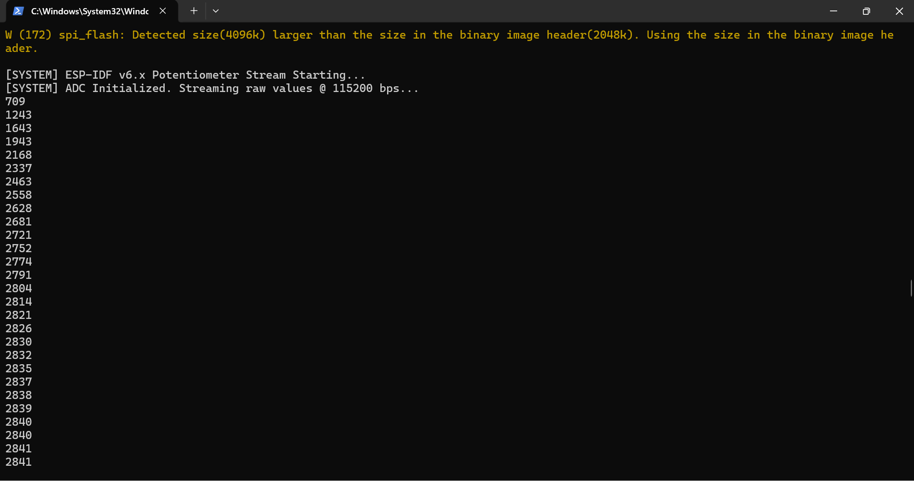

# เฉลย/คำตอบ ใบงานที่ 8.2 — การสตรีมสัญญาณแอนะล็อก ESP32 ออกพอร์ตสื่อสารอนุกรม (UART)

**รหัสนักศึกษา:** 67030098 &nbsp;|&nbsp; **ชื่อ:** Theeranat Phutiwanich &nbsp;|&nbsp; **Branch:** `67030098-HW`

| | |
| :-- | :-- |
| **ใบงานต้นฉบับ** | [07-Labsheet-08-2-ESP32-ADC-and-Serial-Stream.md](../07-Labsheet-08-2-ESP32-ADC-and-Serial-Stream.md) |
| **โค้ดของใบงานนี้** | [`Code/Lab8-2/ESP32_ADC_Stream`](../Code/Lab8-2/ESP32_ADC_Stream) |
| **หัวข้อที่ตอบในไฟล์นี้** | วงจรที่ต่อจริง · Checkpoint 2.1 (2 ข้อ) · Micro-Challenge (LDR) |

---

## วงจรที่ต่อจริง

| ขา ESP32 | ต่อไปที่ | หมายเหตุ |
| :-- | :-- | :-- |
| `3.3V` | Potentiometer ขา 1 (VCC) | **ห้ามใช้ 5V/VIN** — ขา GPIO ทนได้แค่ 3.3V |
| `GND` | Potentiometer ขา 3 (GND) | |
| **`GPIO 32`** | Potentiometer ขา 2 (Wiper) | = **`ADC_CHANNEL_4`** ของ ADC1 |

> ใบงานต้นฉบับใช้ GPIO 34 (`ADC_CHANNEL_6`) แต่วงจรที่ต่อจริงใช้ **GPIO 32**
> ทั้งสองขาอยู่ในกลุ่ม **ADC1** เหมือนกัน จึงไม่ถูก Wi-Fi ยึดครองและใช้งานได้เสถียรเท่ากัน

**หมายเหตุเรื่อง Potentiometer B50K:** ใบงานระบุ 10 kΩ แต่ตัวที่ใช้จริงเป็น **B50K (50 kΩ เทเปอร์เชิงเส้น)**
ที่ตำแหน่งกึ่งกลาง ADC จะมองเห็นความต้านทานต้นทาง (Source Impedance) ประมาณ
$25\text{k} \parallel 25\text{k} = 12.5\text{ k}\Omega$ ซึ่งสูงกว่าค่าที่ ADC ของ ESP32 แนะนำ (ต่ำกว่า 10 kΩ)
ทำให้ตัวเก็บประจุในวงจร Sample-and-Hold ชาร์จไม่ทัน ค่าที่อ่านได้จึงแกว่งมากกว่าปกติ

- **แก้ด้วยซอฟต์แวร์ (ทำแล้วในโค้ด):** อ่านซ้ำ 16 ครั้งแล้วเฉลี่ย (`ADC_SAMPLE_COUNT`) ก่อนส่งเข้าตัวกรอง EMA
- **ถ้ายังแกว่งอยู่:** เพิ่มตัวเก็บประจุ 0.1 µF คร่อมจากขา Wiper ลง GND

---

## Checkpoint 2.1 ทดสอบความเข้าใจ

### ข้อ 1 — `adc_oneshot_read()` คืนค่าผลลัพธ์เป็นตัวเลขแบบใด และมีช่วงค่าต่ำสุด-สูงสุดเท่าใดเมื่อตั้ง `ADC_BITWIDTH_12`

**คำตอบ:**

ต้องแยกให้ชัดว่า "ค่าที่ฟังก์ชันคืน" กับ "ค่าที่อ่านได้จาก ADC" เป็นคนละตัวกัน:

```c
esp_err_t adc_oneshot_read(adc_oneshot_unit_handle_t handle, adc_channel_t chan, int *out_raw);
```

| สิ่งที่ได้ | ชนิดข้อมูล | ความหมาย |
| :-- | :-- | :-- |
| **ค่าที่ฟังก์ชันคืน (return value)** | `esp_err_t` | สถานะความสำเร็จ เช่น `ESP_OK`, `ESP_ERR_TIMEOUT` — จึงต้องครอบด้วย `ESP_ERROR_CHECK()` |
| **ค่าที่อ่านได้จริง** | `int` (ผ่านพารามิเตอร์ `int *out_raw`) | ค่าดิบจากวงจร ADC ที่ถูกเขียนกลับเข้าตัวแปร `raw_val` |

**ช่วงค่าเมื่อตั้ง `ADC_BITWIDTH_12`:**
- **ค่าต่ำสุด = 0**, **ค่าสูงสุด = 4095**
- ที่มา: ความละเอียด 12 บิต → จำนวนระดับ $2^{12} = 4096$ ระดับ → นับจาก 0 ถึง $4096 - 1 = 4095$
- เมื่อใช้คู่กับ `ADC_ATTEN_DB_12` ช่วงแรงดันที่วัดได้คือประมาณ **0 – 3.3 V**
- **ความละเอียดต่อ 1 ระดับ** = $3.3 \text{ V} / 4095 \approx 0.806 \text{ mV}$
- สูตรแปลงกลับเป็นแรงดัน: $V = \dfrac{\text{raw}}{4095} \times 3.3$ (ตรงกับที่ฝั่ง C# ใช้ในใบงาน 8.3)

> **หมายเหตุ:** ค่าที่อ่านได้เป็นค่า**ดิบที่ยังไม่ปรับเทียบ (uncalibrated)** ADC ของ ESP32 มีความ
> ไม่เป็นเชิงเส้นอยู่บ้าง โดยเฉพาะที่ปลายทั้งสองข้าง ในทางปฏิบัติหมุนสุดอาจได้ประมาณ 0–4095
> แต่ไม่แตะค่าสุดขั้วพอดีเป๊ะ หากต้องการความแม่นยำสูงต้องใช้ `adc_cali_*` API เพิ่ม

---

### ข้อ 2 — ทำไมต้องกด `Ctrl + ]` ปิด ESP-IDF Monitor ก่อนรันโปรแกรม C# Kestrel

**คำตอบ:**

เพราะ **พอร์ตอนุกรม (COM Port) เป็นทรัพยากรที่ใช้ได้ทีละโปรเซสเท่านั้น (Exclusive Access)**
ระบบปฏิบัติการ Windows จะล็อกอุปกรณ์ไว้ให้โปรเซสแรกที่เปิดสำเร็จ และปฏิเสธทุกโปรเซสที่ขอเปิดตามมา

**ถ้าปล่อยให้ `idf.py monitor` เปิดค้างไว้แล้วรัน `dotnet run` จะเกิด:**

1. คำสั่ง `serial.Open()` ในคลาส `SerialBridgeWorker` จะโยน
   **`UnauthorizedAccessException: Access to the port 'COM24' is denied`**
2. โค้ดใน `try-catch` จับข้อผิดพลาดนี้ไว้ แล้วเขียน log ว่า
   `⚠️ ไม่สามารถเปิด COM24 -> สลับเข้าโหมดจำลอง`
3. ระบบจึงตกไปทำงานใน **Simulation Mode** — หน้าเว็บยังมีตัวเลขวิ่งอยู่ (เป็นคลื่นไซน์)
   **แต่ไม่ตอบสนองต่อการหมุน Potentiometer** ซึ่งเป็นอาการที่ทำให้เข้าใจผิดว่าโปรแกรมเสีย
   ทั้งที่จริงแค่พอร์ตถูกยึดอยู่

**การกด `Ctrl + ]`** จะสั่งให้โปรเซส monitor จบการทำงานและ**คืน handle ของพอร์ตกลับสู่ระบบ**
ทำให้ฝั่ง C# เปิดพอร์ตได้สำเร็จและเข้าสู่ Live Mode

> **จุดตรวจสอบเวลาเจอปัญหา:** ถ้าเว็บขึ้น `Simulation Mode` ทั้งที่เสียบสาย USB อยู่ ให้ไล่เช็ค
> โปรแกรมที่อาจยึดพอร์ตไว้ตามลำดับ — ESP-IDF Monitor, Arduino IDE Serial Monitor/Plotter,
> PuTTY, VS Code Serial Monitor extension หรือ `dotnet run` ตัวเก่าที่ยังไม่ปิด

---

## ภารกิจท้าทาย (Micro-Challenge) — ทดลองเปลี่ยนเป็น LDR

**การต่อวงจรแบ่งแรงดัน (Voltage Divider):**

```text
   3.3V ──┬── LDR ──┬── GPIO 32 (ADC1_CH4)
          │         │
          │        10kΩ
          │         │
   GND ───┴─────────┘
```

**ผลการทดลองที่คาดหวัง** (ขึ้นกับรูปแบบการต่อ — ต่อ LDR ด้านบนตามผังข้างต้น):

| สภาพแสง | ความต้านทาน LDR | แรงดันที่ GPIO 32 | ค่า ADC โดยประมาณ |
| :-- | :-- | :-- | :-- |
| ส่องไฟฉายมือถือใกล้ๆ | ต่ำมาก (~1 kΩ) | สูง (~3.0 V) | **สูง ~3,700 – 4,000** |
| แสงในห้องปกติ | ปานกลาง (~10 kΩ) | ~1.65 V | **กลางๆ ~1,800 – 2,200** |
| เอามือปิดสนิท | สูงมาก (~200 kΩ+) | ต่ำ (~0.2 V) | **ต่ำ ~150 – 400** |

**ข้อสังเกตที่ควรบันทึกในรายงาน:**
1. LDR มีความสัมพันธ์แบบ**ไม่เป็นเชิงเส้น (Non-linear)** กับความเข้มแสง — ต่างจาก Potentiometer
   ที่หมุนเท่าไรค่าขึ้นเป็นสัดส่วนตรงๆ
2. **ถ้าสลับตำแหน่ง LDR กับตัวต้านทาน 10 kΩ ทิศทางของค่าจะกลับด้าน** (สว่างแล้วค่าลดลงแทน)
   จึงต้องบันทึกผังวงจรที่ใช้จริงกำกับไว้ด้วยเสมอ
3. ค่าที่อ่านได้ไวต่อแสงจากหลอดไฟ AC (กระพริบ 50 Hz) — **EMA filter `alpha = 0.25`
   ที่ทำในกิจกรรมที่ 3 ช่วยลดอาการสั่นตรงนี้ได้ชัดเจน**
4. โค้ดเฟิร์มแวร์**ไม่ต้องแก้เลยแม้แต่บรรทัดเดียว** เพราะทั้งสองเซนเซอร์ต่างก็เป็นตัวต้านทาน
   ที่ให้แรงดันแอนะล็อกเข้าขาเดิม — เป็นตัวอย่างที่ดีของการแยกส่วนระหว่างฮาร์ดแวร์กับซอฟต์แวร์

**หลักฐานการส่งงาน:** ภาพถ่ายการต่อวงจร + ภาพหน้าจอ Monitor ขณะส่องไฟและขณะเอามือปิด

---

## 📸 ภาพบันทึกผลการทดลอง

### ภาพที่ 1 — ESP-IDF Monitor ขณะสตรีมค่า ADC



**สิ่งที่เห็นในภาพ**

| สิ่งที่สังเกตได้ | ความหมาย |
| :-- | :-- |
| `[SYSTEM] ESP-IDF v6.x Potentiometer Stream Starting...` | เฟิร์มแวร์บูตและเริ่มทำงาน |
| `[SYSTEM] ADC Initialized. Streaming raw values @ 115200 bps...` | ตั้งค่า ADC สำเร็จ เริ่มสตรีมที่ 115200 bps |
| ตัวเลขไล่จาก `709` → `2841` ทีละบรรทัด | ค่า ADC ขณะค่อยๆ หมุน Potentiometer ไปทางขวา |
| ช่วงท้ายค่านิ่งที่ `2840, 2840, 2841, 2841` | หยุดหมุนแล้วค่าเสถียร ไม่กระโดด — **ผลของตัวกรอง EMA** |

**หลักฐานว่าตัวกรอง EMA ทำงาน:** สังเกตว่าตัวเลขไม่กระโดดข้ามเป็นช่วงกว้าง แต่ไล่ขึ้นแบบนุ่มนวล
(`2804 → 2814 → 2821 → 2826 → 2830 → 2832`) ระยะห่างค่อยๆ แคบลงจนลู่เข้าหาค่าจริง
ซึ่งเป็นพฤติกรรมเฉพาะตัวของ Exponential Moving Average

> **หมายเหตุ:** ข้อความ `W (172) spi_flash: Detected size(4096k) larger than the size in the
> binary image header(2048k)` เป็นเพียง **คำเตือน (Warning)** ว่าชิปแฟลชจริงมีขนาด 4 MB
> แต่ header ในไฟล์ระบุไว้ 2 MB ระบบจะใช้ค่าจาก header ต่อไปได้ตามปกติ ไม่กระทบการทำงาน

---

&larr; [ใบงานที่ 8.1](ANSWER-Lab8-1.md) &nbsp;•&nbsp; [สารบัญคำตอบทั้งหมด](README.md) &nbsp;•&nbsp; [ใบงานที่ 8.3](ANSWER-Lab8-3.md) &rarr;
