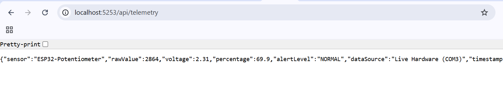

# เฉลย/คำตอบ ใบงานที่ 8.3 — สะพานเชื่อมฮาร์ดแวร์จริงสู่เว็บเซิร์ฟเวอร์ (Hardware Serial Bridge)

**รหัสนักศึกษา:** 67030098 &nbsp;|&nbsp; **ชื่อ:** Theeranat Phutiwanich &nbsp;|&nbsp; **Branch:** `67030098-HW`

| | |
| :-- | :-- |
| **ใบงานต้นฉบับ** | [08-Labsheet-08-3-Hardware-Serial-Bridge-to-Web.md](../08-Labsheet-08-3-Hardware-Serial-Bridge-to-Web.md) |
| **โค้ดของใบงานนี้** | [`Code/Lab8-3/Kestrel_Serial_Gateway`](../Code/Lab8-3/Kestrel_Serial_Gateway) |
| **หัวข้อที่ตอบในไฟล์นี้** | Checkpoint 3.1 (3 ข้อ) · Micro-Challenge (alertLevel) |

---

## Checkpoint 3.1 ทดสอบกลไก Fallback Simulation

> **การทดลอง:** ขณะโปรแกรม C# กำลังรัน ให้ถอดสาย USB ของ ESP32 ออก แล้วกด Refresh หลายๆ ครั้ง

### คำถามที่ 1 — ค่า `dataSource` เปลี่ยนเป็นอะไร

**คำตอบ:** เปลี่ยนจาก `"Live Hardware (COM24)"` เป็น **`"Simulation Mode (Sine Wave)"`**

บน Terminal จะเห็น log ตามลำดับดังนี้:
```text
⚠️ ไม่สามารถเปิด COM24 (...) -> สลับเข้าโหมดจำลอง
🔍 ไม่พบพอร์ต USB -> ทำงานในโหมดจำลอง (Simulation Mode)
```

### คำถามที่ 2 — ค่า `rawValue` ยังเปลี่ยนได้อยู่หรือไม่ และเปลี่ยนในลักษณะใด

**คำตอบ:** **ยังเปลี่ยนอยู่ แต่เปลี่ยนด้วยกลไกคนละแบบกับตอนเสียบสาย**

| หัวข้อ | Live Mode (เสียบสาย) | Simulation Mode (ถอดสาย) |
| :-- | :-- | :-- |
| แหล่งที่มาของค่า | ADC จริงบน ESP32 | สูตรคณิตศาสตร์ในฝั่ง C# |
| ลักษณะการเปลี่ยน | เปลี่ยนตามมือหมุน หยุดหมุนค่าก็นิ่ง | **แกว่งเป็นคลื่นไซน์ขึ้น-ลงเองอัตโนมัติ ไม่มีวันหยุดนิ่ง** |
| ควบคุมได้หรือไม่ | ควบคุมได้ด้วยมือ | ควบคุมไม่ได้ เดินไปตามเวลา |

**รายละเอียดของสัญญาณจำลอง** จากโค้ดในใบงาน:

```csharp
double t = Environment.TickCount64 / 1000.0;                 // เวลาเป็นวินาที
int simAdc = (int)((Math.Sin(t * 1.5) + 1.0) / 2.0 * 4095);  // คลื่นไซน์
```

- `Math.Sin()` ให้ค่าในช่วง **−1 ถึง +1** → `(sin + 1) / 2` ปรับให้เป็น **0 ถึง 1** → คูณ 4095
  ได้ช่วง **0 – 4095** พอดีกับสเกล ADC 12 บิต
- ความถี่เชิงมุม 1.5 rad/s → **คาบการแกว่ง** $T = \dfrac{2\pi}{1.5} \approx 4.19$ วินาทีต่อรอบ
- อัปเดตทุก 100 ms และวนอยู่ในโหมดจำลองรอบละ 2 วินาที (20 ครั้ง) ก่อนกลับไปสแกนหาพอร์ตใหม่
  — ออกแบบมาเพื่อ**ไม่ให้ log รกเกินไป** และเพื่อให้**เสียบสายกลับเข้าไปแล้วระบบกลับสู่
  Live Mode ได้เองภายในไม่เกิน ~2 วินาที**

### คำถามที่ 3 — ข้อสรุปเชิงสถาปัตยกรรม

**คำตอบ:** **เว็บเซิร์ฟเวอร์ไม่ล่มและ API ไม่เคยตอบ error แม้ฮาร์ดแวร์จะหายไป**

นี่คือหัวใจของสถาปัตยกรรม **Dual-Mode (Auto-Detect & Fallback)** ที่ทำให้ระบบมีคุณสมบัติ
**Graceful Degradation** — เมื่อองค์ประกอบหนึ่งล้มเหลว ระบบลดระดับการทำงานลงแทนที่จะพังทั้งระบบ

ประโยชน์ในทางปฏิบัติ:
1. **ทีมพัฒนาหน้าเว็บ (Frontend) ทำงานต่อได้โดยไม่ต้องมีบอร์ดจริง** — สำคัญมากในใบงาน 8.4
   ที่ต้องออกแบบหน้าปัด SVG
2. **สาย USB หลุดชั่วคราวไม่ทำให้บริการหยุด** และเสียบกลับก็คืนสู่ Live Mode อัตโนมัติ
3. เป็นการแยก **"ผู้ผลิตข้อมูล (Producer)"** ออกจาก **"ผู้บริโภคข้อมูล (Consumer)"** อย่างสมบูรณ์
   ผ่าน `TelemetryStateStore` ที่อยู่ตรงกลาง — ฝั่ง API ไม่รู้และไม่จำเป็นต้องรู้เลยว่าค่าที่อ่านได้
   มาจากฮาร์ดแวร์จริงหรือจากสูตรคณิตศาสตร์

> **จุดสังเกตเพิ่มเติมที่ควรบันทึก:** ฟิลด์ `timestamp` ยังคงขยับตลอดเวลาทั้งสองโหมด แสดงว่า
> `BackgroundService` ยังทำงานอยู่ตลอดโดยไม่ถูกบล็อก — เป็นผลจาก `await Task.Yield()`
> ที่ต้นเมธอด `ExecuteAsync` ซึ่งคืนสิทธิ์ให้ Host เริ่ม Kestrel ได้ก่อน

---

## ภารกิจท้าทาย (Micro-Challenge) — เพิ่มฟิลด์ `alertLevel`

**โจทย์:** `> 85%` → `"DANGER (HIGH)"` | `70 – 85%` → `"WARNING"` | `< 70%` → `"NORMAL"`

**โค้ดที่ต้องแก้ใน endpoint `/api/telemetry`:**

```csharp
app.MapGet("/api/telemetry", (TelemetryStateStore state) => {
    var (raw, voltage, percent, source, updated) = state.GetSnapshot();

    // ---- Micro-Challenge 8.3 : จัดระดับการแจ้งเตือนจากเปอร์เซ็นต์ ----
    string alertLevel = percent switch
    {
        > 85.0 => "DANGER (HIGH)",
        >= 70.0 => "WARNING",
        _ => "NORMAL"
    };

    return Results.Ok(new {
        sensor     = "ESP32-Potentiometer",
        rawValue   = raw,
        voltage    = voltage,
        percentage = percent,
        alertLevel = alertLevel,
        dataSource = source,
        timestamp  = updated.ToString("yyyy-MM-ddTHH:mm:ss.fffZ")
    });
});
```

**ตารางตรวจสอบขอบเขต (Boundary Test) สำหรับถ่ายภาพหน้าจอส่งงาน:**

| หมุน pot ไปที่ | `rawValue` โดยประมาณ | `percentage` | `alertLevel` ที่ถูกต้อง |
| :-- | :-- | :-- | :-- |
| ซ้ายสุด | ~0 | 0.0 | `NORMAL` |
| ประมาณ 1/2 | ~2048 | 50.0 | `NORMAL` |
| ก่อนถึง 70% เล็กน้อย | ~2825 | 69.0 | `NORMAL` |
| **ที่ 70% พอดี** | ~2867 | **70.0** | **`WARNING`** ← จุดที่ต้องระวัง |
| ประมาณ 3/4 | ~3200 | 78.1 | `WARNING` |
| **ที่ 85% พอดี** | ~3481 | **85.0** | **`WARNING`** ← ไม่ใช่ DANGER |
| เกิน 85% | ~3600 | 87.9 | `DANGER (HIGH)` |
| ขวาสุด | ~4095 | 100.0 | `DANGER (HIGH)` |

> **จุดที่มักทำผิด:** โจทย์ระบุว่า `WARNING` คือช่วง **70.0 – 85.0** (รวมปลายทั้งสองข้าง) และ
> `DANGER` คือ **มากกว่า 85.0** ดังนั้นที่ **85.0 พอดีต้องได้ `WARNING`** ไม่ใช่ `DANGER`
> โค้ดข้างบนใช้ `> 85.0` และ `>= 70.0` ตามลำดับจึงถูกต้องตามโจทย์
> (นิพจน์ `switch` จะตรวจเงื่อนไข**จากบนลงล่าง** และหยุดที่เงื่อนไขแรกที่เป็นจริง)

**หลักฐานการส่งงาน:** ภาพหน้าจอเบราว์เซอร์ขณะหมุนไปที่ระดับต่างๆ อย่างน้อย 3 ภาพ
ให้เห็นครบทั้ง `NORMAL`, `WARNING` และ `DANGER (HIGH)`

---

## 📸 ภาพบันทึกผลการทดลอง

### ภาพที่ 1 — `/api/telemetry` ขณะเชื่อมต่อฮาร์ดแวร์จริง (Live Mode)



**ตรวจสอบค่าที่ได้ทีละฟิลด์**

| ฟิลด์ | ค่าที่ได้ | ตรวจสอบ |
| :-- | :-- | :-- |
| `sensor` | `ESP32-Potentiometer` | ✅ |
| `rawValue` | `2864` | ✅ อยู่ในช่วง ADC 12 บิต (0 – 4095) |
| `voltage` | `2.31` | ✅ ตรงกับสูตร $\frac{2864}{4095} \times 3.3 = 2.308$ |
| `percentage` | `69.9` | ✅ ตรงกับสูตร $\frac{2864}{4095} \times 100 = 69.94$ |
| `alertLevel` | `NORMAL` | ✅ **ถูกต้อง** เพราะ 69.9 < 70.0 (ถ้าเกิน 70 จะเป็น `WARNING`) |
| `dataSource` | `Live Hardware (COM3)` | ✅ **อ่านจากบอร์ดจริง ไม่ใช่ Simulation Mode** |

> ภาพนี้เป็นหลักฐานของ **Micro-Challenge** ด้วย — ค่า `69.9%` อยู่ใกล้เส้นแบ่ง 70% มาก
> แต่ระบบยังจัดเป็น `NORMAL` ได้ถูกต้อง แสดงว่าเงื่อนไข `>= 70.0` ทำงานตรงตามโจทย์

---

&larr; [ใบงานที่ 8.2](ANSWER-Lab8-2.md) &nbsp;•&nbsp; [สารบัญคำตอบทั้งหมด](README.md) &nbsp;•&nbsp; [ใบงานที่ 8.4](ANSWER-Lab8-4.md) &rarr;
